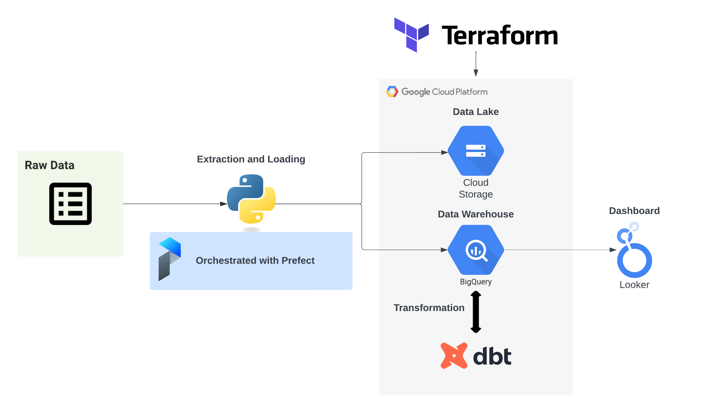

# Tennis Analytics Pipeline
- [Introduction](#introduction)
- [Data Source](#data-source)
- [Tech Stack](#tech-stack)
- [Data Pipeline](#data-pipeline)
- [Reporting](#reporting)

## Introduction
This project builds a batch extract, load, and transform (ELT) pipeline to gather tennis match-level data for the ATP main tour and Challengers tour and prepares it for visualization in a dashboard. During the tennis season (approximately January - November), this pipeline is orchestrated to run on a weekly schedule to provide answers to questions like:

- What players are performing best in the current season?
- What players on the Challengers Tour are likely candidates as the next "up and coming" players?
- What players have served up the most bagels over their career? 

## Data Source
This project relies on Jeff Sackman's [tennis match data](https://github.com/JeffSackmann/tennis_atp) repos, which are updated on roughly a weekly basis during the tennis season. The pipeline extracts ATP main tour level data from 1968 through the current season and Challengers data from 1978 through the current season. While match outcomes are available for all years, match statistics (e.g., number of aces, number of break points, etc.) are generally only avaiable from the mid-1990s onwards. 

## Tech Stack
- [Python/Pandas](https://pandas.pydata.org/): Extraction and loading of raw data from data source to the data lake and data warehouse.
- [Google Cloud Platform (GCP)](https://cloud.google.com/): Storage of raw files in a Google Cloud Storage bucket and utilizng BigQuery as our data warehouse.
- [Terraform](https://www.terraform.io/): Creating our GCP infrastructure as code.
- [Prefect](https://www.prefect.io/): Orchestration and monitoring of the ELT pipeline.
- [dbt](https://www.getdbt.com/): Staging and transformation of the data in BigQuery.
- [Looker Studio](https://lookerstudio.google.com/overview): Creating the analytics dashboard.

## Data Pipeline

- Terraform is used to create our GCP infrastructure as code, including a Cloud Storage bucket to serve as our data lake and three BigQuery datasets: a dataset for untransformed data, a staging dataset for intermediate views and tables, and a production dataset to store final tables after transformation in dbt.
- Prefect is used to orchestrate the extraction and loading of data by creating flows to extract data from the tennis data repository, do some minor cleaning (conversion of strings to timestamps), and load the data to Cloud Storage and BigQuery. Flows are scheduled to be executed on a weekly basis.
- DBT is used to transform the data. Staging models are created that ensure correct typing of variables and to create unique identifiers for the ATP main tour and Challengers matches. Core models union main tour and Challengers tables into a single table of all matches. Aggregated tables are created from this core model to be utilized in dashboarding.
  - Tests are used to ensure integrity of the data, including tests for lack of nulls in unique identifiers, uniqueness of identifiers, referential integrity, and acceptable values for numeric data.

- Looker Studio is used to visualize the transformed data. 

## Reporting
The final analytics dashboards is available here:

[Tennis Analytics Dashboard](https://lookerstudio.google.com/reporting/faf90ed4-8bda-40dd-9a1b-cdd4466e6d49)

A selection of pages from the dashboard are included below:

Page 1:

Page 2:

